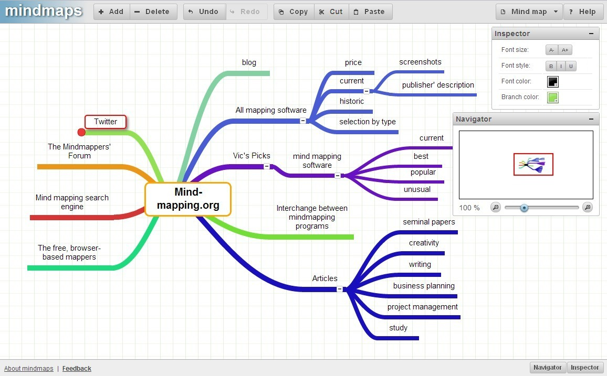

<!--
Este archivo README esta generado automaticamente<https://github.com/YunoHost/apps/tree/master/tools/readme_generator>
No se debe editar a mano.
-->

# Mindmaps para Yunohost

[](https://dash.yunohost.org/appci/app/mindmaps)  

[](https://install-app.yunohost.org/?app=mindmaps)

*[Leer este README en otros idiomas.](./ALL_README.md)*

> *Este paquete le permite instalarMindmaps rapidamente y simplement en un servidor YunoHost.*  
> *Si no tiene YunoHost, visita [the guide](https://yunohost.org/install) para aprender como instalarla.*

## Descripción general

Mindmaps is a HTML5 based mind mapping application. It lets you create neat looking mind maps in the browser.


**Versión actual:** 0.0.20201010~ynh4

**Demo:** <https://www.mindmaps.app/>

## Capturas



## :red_circle: Características no deseables

- **Upstream not maintained**: This software is not maintained anymore. Expect it to break down over time, be exposed to unfixed security breaches, etc.

## Documentaciones y recursos

- Sitio web oficial: <https://www.mindmaps.app/>
- Repositorio del código fuente oficial de la aplicación : <https://github.com/drichard/mindmaps>
- Catálogo YunoHost: <https://apps.yunohost.org/app/mindmaps>
- Reportar un error: <https://github.com/YunoHost-Apps/mindmaps_ynh/issues>

## Información para desarrolladores

Por favor enviar sus correcciones a la [`branch testing`](https://github.com/YunoHost-Apps/mindmaps_ynh/tree/testing

Para probar la rama `testing`, sigue asÍ:

```bash
sudo yunohost app install https://github.com/YunoHost-Apps/mindmaps_ynh/tree/testing --debug
o
sudo yunohost app upgrade mindmaps -u https://github.com/YunoHost-Apps/mindmaps_ynh/tree/testing --debug
```

**Mas informaciones sobre el empaquetado de aplicaciones:** <https://yunohost.org/packaging_apps>
