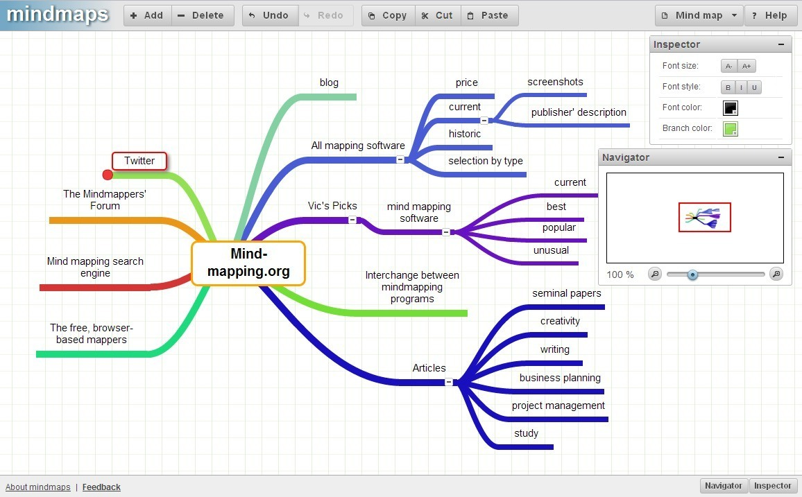

<!--
Ohart ongi: README hau automatikoki sortu da <https://github.com/YunoHost/apps/tree/master/tools/readme_generator>ri esker
EZ editatu eskuz.
-->

# Mindmaps YunoHost-erako

[](https://dash.yunohost.org/appci/app/mindmaps)  

[](https://install-app.yunohost.org/?app=mindmaps)

*[Irakurri README hau beste hizkuntzatan.](./ALL_README.md)*

> *Pakete honek Mindmaps YunoHost zerbitzari batean azkar eta zailtasunik gabe instalatzea ahalbidetzen dizu.*  
> *YunoHost ez baduzu, kontsultatu [gida](https://yunohost.org/install) nola instalatu ikasteko.*

## Aurreikuspena

Mindmaps is a HTML5 based mind mapping application. It lets you create neat looking mind maps in the browser.


**Paketatutako bertsioa:** 0.0.20201010~ynh4

**Demoa:** <https://www.mindmaps.app/>

## Pantaila-argazkiak



## :red_circle: Ezaugarri zalantzagarriak

- **Jatorrizko garapena utzita**: Software honek ez du arduradunik. Denborak aurrera egin ahala funtzionatzeari utziko dio, konpondu gabeko segurtasun arazoak izango ditu, etab.

## Dokumentazioa eta baliabideak

- Aplikazioaren webgune ofiziala: <https://www.mindmaps.app/>
- Jatorrizko aplikazioaren kode-gordailua: <https://github.com/drichard/mindmaps>
- YunoHost Denda: <https://apps.yunohost.org/app/mindmaps>
- Eman errore baten berri: <https://github.com/YunoHost-Apps/mindmaps_ynh/issues>

## Garatzaileentzako informazioa

Bidali `pull request`a [`testing` abarrera](https://github.com/YunoHost-Apps/mindmaps_ynh/tree/testing).

`testing` abarra probatzeko, ondorengoa egin:

```bash
sudo yunohost app install https://github.com/YunoHost-Apps/mindmaps_ynh/tree/testing --debug
edo
sudo yunohost app upgrade mindmaps -u https://github.com/YunoHost-Apps/mindmaps_ynh/tree/testing --debug
```

**Informazio gehiago aplikazioaren paketatzeari buruz:** <https://yunohost.org/packaging_apps>
